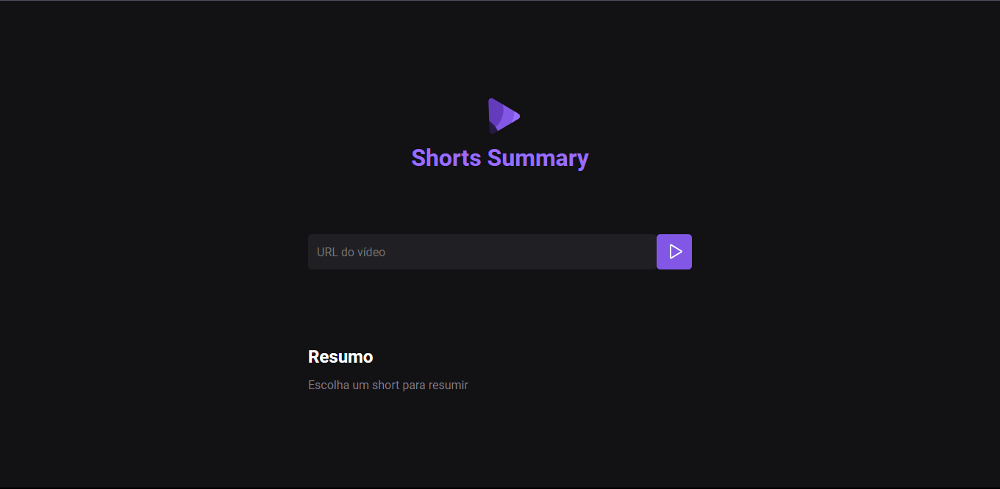

# NLW IA - Shorts Summary
  
***Desenvolvido no evento NLW IA da @Rocketseat!***

> Shorts Summary é uma aplicação web para criar resumo de vídeos shorts do youtube utilizando **Inteligência Artificial** para transcrever o conteúdo do vídeo e realizar o resumo do conteúdo. Esse projeto é desenvolvido na trilha **FOUNDATIONS** na edição **NLW IA**.

> Status: ***Concluído...*** ✅ 
## Algumas das Tecnologias Abordadas: 🚀

  

## Links Externos 🔗

